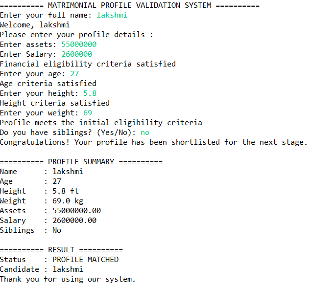

# 💍 Matrimonial Profile Matcher

## 📌 Description
Matrimonial Profile Matcher is a Java console application that validates a candidate's profile based on predefined eligibility criteria. The application checks financial details, age, height, weight, and sibling status before determining whether the profile is shortlisted.

## 🚀 Technologies Used
- Java
- OOP Concepts
- Scanner Class
- Eclipse IDE

## ✨ Features
- Accepts candidate profile details.
- Validates assets and salary eligibility.
- Checks age, height, and weight criteria.
- Verifies sibling status.
- Displays a detailed profile summary for eligible candidates.
- Shows appropriate success or rejection messages.
- Handles invalid Yes/No input for sibling status.

## ▶️ How to Run
1. Open the project in Eclipse IDE.
2. Run the `MatrimonialProfileMatcher.java` file.
3. Enter the required profile details.
4. View the profile validation result.

## 📷 Program Output

### Screenshot 1

## 👩‍💻 Author
Venkata Lakshmi Veerisetty
